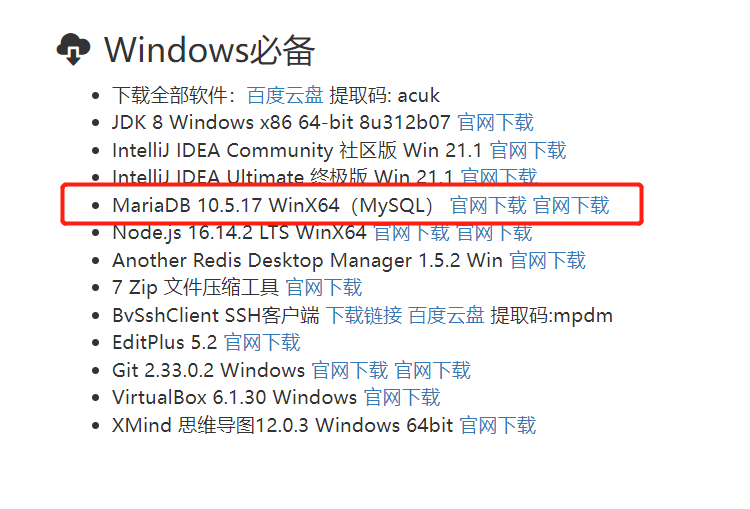
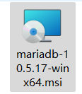
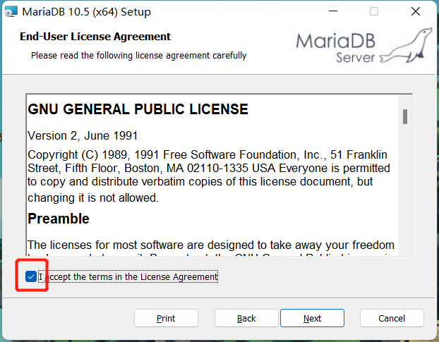
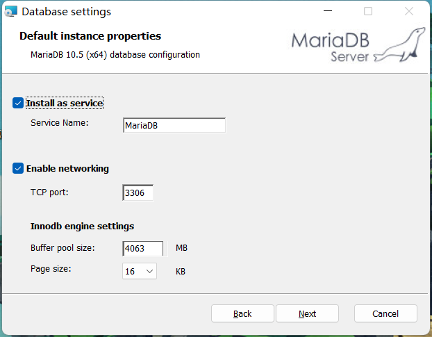
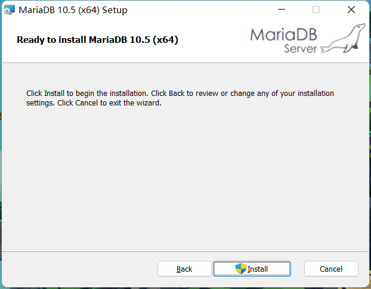
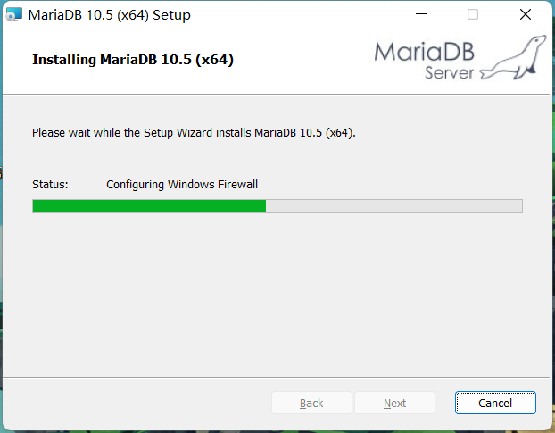
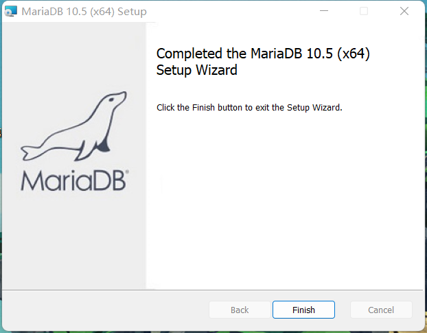
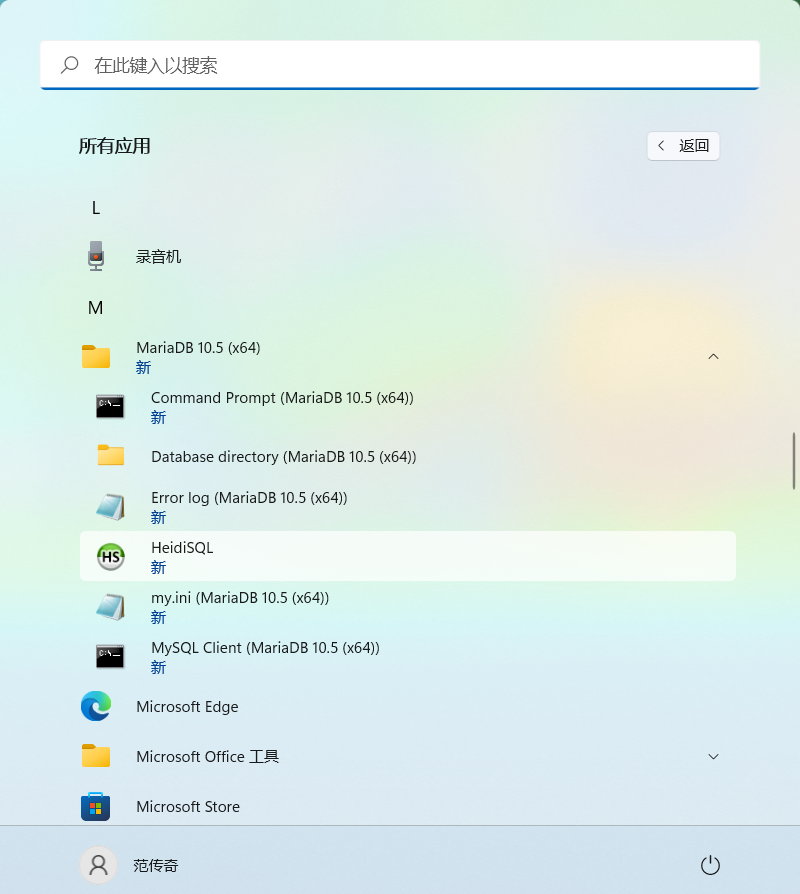
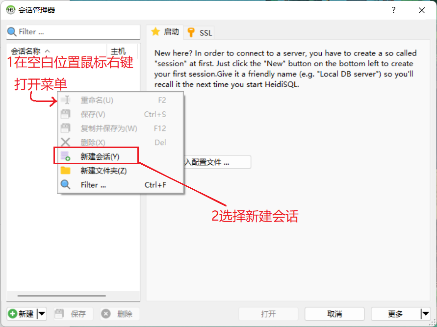
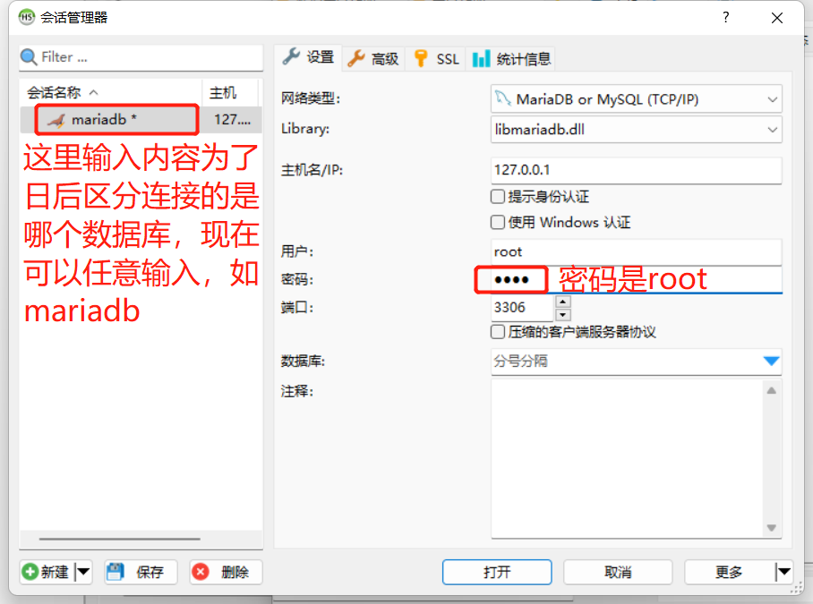

# MariaDB安装

### 下载安装文件，去:http://doc.canglaoshi.org网站下载

### 运行下载后的安装文件

### 之后按照途中步骤进行安装

- 点击next

- 勾选图中的接受条款后点击next

- 这里可以点击Browse按钮修改安装路径，但是一般默认位置即可。之后点击next

- 这里为root用户添加密码，密码也先输入root即可，之后字符集勾选Use UTF8...选项后点next

  

- 直接点击next

  

- 点击Install安装

  

- 等待安装...

  

- 点击finish完成安装

  

## 测试MariaDB的连接

在开始菜单中找到MariaDB，并打开HeidiSQL

创建一个会话用于测试连接数据库

输入下图内容后点击打开

可以看到下图说明一切正常

