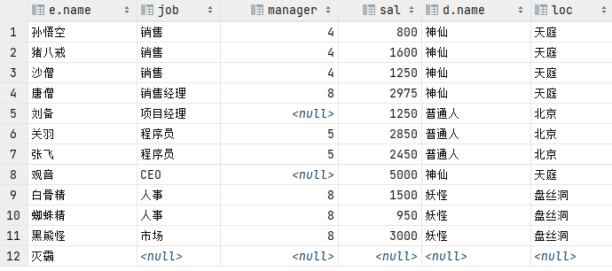
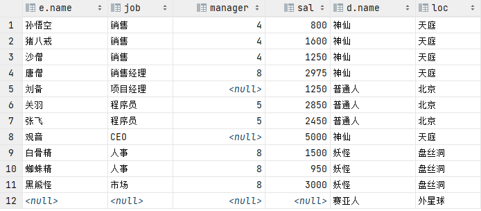
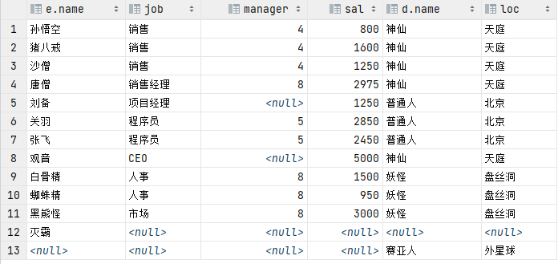

# 1.数据库
#### 我们创建的一个目录users,里面存放了很多的obj文件,每一个文件保存了一组信息.users就是一个
#### 数据库.只是我们管理起来要么手动,要么写一些代码进行维护.
#### 低效，不通用.
#### 数据库管理系统DBMS: DataBaseManagementSystem

## (1).常见的数据库管理系统:
#### 1.MySQL
#### 2.ORACLE
#### 3.SQLServer
#### 4.DB2

## (2).主要的学习目标:
#### SQL：Structured Query Language
#### 学习SQL语句。
#### SQL语句是我们操作数据库的语言，通过执行SQL可以完成对数据的相关操作。
## (3).连接数据库的形式:
#### 1:控制台(命令行)的客户端
#### 2:第三方图形界面的软件
#### 3:IDEA这样的集成开发环境中也带有连接数据库的操作
#### 4:使用JDBC连接数据库

### 注：在MySQL中,我们可以为不同的项目创建不同的数据库,而每个数据库中都可以创建若干张表,每张表用来保存一组数据,比如我们为保存用户信息可以创建userinfo表,保存文章信息可以创建article表等

## (4). SQL语句分类：
### DDL(数据定义语言)
### DML(数据操作语言)
### DQL(数据查询语言)
### TCL(事务控制语言)
### DCL(数据控制语言)

# 2. 表相关的操作
### DDL语句:数据定义语言,用来操作数据库对象的.
### 数据库对象:表,视图,索引都属于数据库对象.

# ★总结：
## DDL语言:数据定义语言,操作数据库对象
## 关键字:CREATE,ALTER,DROP,ADD,CHANGE
### 1. 创建表:CREATE TABLE 表名();
### 2. 添加表中结构: ALTER TABLE 表名 ADD 要添加的列名 类型[长度] AFTER 字段名(在...之后);
### 3. 删除表中结构: ALTER TABLE 表名 DROP 要删除的列名;
### 4. 修改表: ALTER TABLE 表名 CHANGE 原字段名 新字段名 新类型;
### 5. 删除表: DROP TABLE;
# ★总结：
## 1. DML语言:数据操作语言,是对表中的数据进行操作的语言,包含:增,删,改操作
### 关键字:[INSERT语句 INTO VALUES] [DELETE语句 FROM] [UPDATE语句 SET WHERE] 
### (1). 表中插入数据: INSERT INTO 表名(列名) VALUES(传参)
### (2). 删除表数据: DELETE FROM 表名 [WHERE 过滤条件]---若不加条件就会删除整张表及所有数据
### (3). 修改表数据: UPDATE 表名 SET 字段值=？ [WHERE 过滤条件]---若不加条件可能引起范围修改

## 2. 数据类型
### (1). 整数:INT(m)和BIGINT(m).m表示的是长度 例如:m=5 存数字18 实际存储:00018
### (2). 浮点数:DOUBLE(m,n)。m表示数字长度(整体数字的长度，包含小数)，n表示小数位 DOUBLE(5,3) 99.999
### 注：INSERT INTO XXX VALUES(12.9984) 实际插入数据时当精度超过可保存范围时，会进行四舍五入

## 3. 字符类型
### (1). CHAR(n):定长字符串。每条记录实际占用的字节空间是定长的，不足的部分补充空字符来满足长度要求
####       优点:查询速度快  缺点:浪费磁盘空间
### (2). VARCHAR(n):(变长字符串)。最多存n指定的字节数对应的字符，实际保存是用多少占多少。(推荐)
####         优点:节省磁盘空间 缺点:查询速度慢
### (3). TEXT(n):可变长字符串，最大65535
## 4. 日期时间类型
### (1). DATE:保存年月日
### (2). TIME:保存时分秒
### (3). DATETIME:保存年月日十分秒
### (4). TIMESTAMP:时间戳，记录UTC时间，从1970-01-01 00:00:00到表示的时间之间经过的毫秒
## 5. 约束
### (约束是为表中某个字段添加特定的限制条件，只有符合条件的记录才可以保存)
### 1. 非空约束:该字段的值不允许为空
### 2. 外键约束:实际开发中几乎不使用外键约束

# ★总结： 
## DQL语句：数据查询语句
## 1. 基本语法：
### SELECT 字段名1[,字段名2...或 * ] FROM 表名;
## 2. WHERE子句,用来添加过滤条件,此时可以仅将满足条件的记录查询出来
### 比较运算符：=,>,>=,<,<=,<>(不等于)----!=操作不是所有的数据库都支持
###  SELECT(选择) FROM(来自于) WHERE(哪里)
## 3. AND,OR来连接多个条件---★AND优先级高于OR,可以通过括号()来提高OR的优先级
### AND:都为真时才为真-------------相当于java中&&(与)  但这里不存在短路现象
### OR:都为假时才为假-------------相当于java中||(或)
### 例：查看2号部门工资高于1000的员工的名字,工资,职位,部门编号？---两个条件AND
    SELECT name,sal,job,dept_id
    FROM emp
    WHERE dept_id=2 AND sal>1000;
## 4.IN(列表) 值在列表中(等于列表中的其中之一)----★获取同一字段的子集时用IN
##   NOT IN(不在列表) 值不在列表中
### 例：查看职位是人事和销售的所有员工的名字,工资,职位,部门编号？
    SELECT name,sal,job,dept_id
    FROM emp
    WHERE job IN('人事','销售');
## 5. (1).DISTINCT用于去除指定列重复值的行----distinct(不同的)
### 例：查看公司有多少种职位？---单列去重
    SELECT DISTINCT job 
    FROM emp;
##    (2).多列去重时,就是去除指定这些列的值的组合有重复的行
### 例：去除职位与部门编号重复的行
    SELECT DISTINCT job,dept_id 
    FROM emp;
## 6. 模糊查询:LIKE
### LIKE中两个通配符:_和%
### (1). _(下划线):表示任意的一个字符
### (2). %:表示任意个字符(0-多个)
### 例：查看姓孙的员工信息？(名字第一个字符是孙的员工)
    SELECT *
    FROM emp
    WHERE name LIKE '孙%';
## 总结：
### 1. %X%：字符串中包含'X'
### 2. %X：字符串以X结尾
### 3. X%：字符串以X开头
### 4. _X%：字符串第二个字符是X
### 5. %X_：倒数第二个字符是X
### 6. X%Y：字符串以X开头以Y结尾
### 7. X_Y：字符串只有三个字,第一个是X,第三个是Y
## 7. 排序-----ORDER(order顺序)----ASC升序(默认),DESC降序
### ORDER BY子句,根据指定的字段排序查询结果集,该子句只能放在查询语句的最后一个子句上
### 例：查看公司所有员工的姓名和工资,且按工资从低到高排序
    SELECT name,sal
    From emp
    ORDER BY sal;
## 8.分页查询----LIMIT(A,B)(limit 限制)
### (1). 将满足查询条件的数据分段分批的查询出来。这可以减少不必要的系统开销。
### (2). 分页查询在SQL92标准没有定义，这意味着不同的数据库，分页查询方式完全不一样。
### (3). 在ORDER BY中使用LIMIT来完成的
### (4). A: "跳过的"记录数,请求的记录数(每页显示的记录数)
### (5). B: (页数-1)*每页显示的记录数,每页显示的记录数
### (6). 不跟在ORDER BY后面也行,但建议跟,因为排序后再分页比较清晰
## 9. 查询的字段可以使用表达式
### 例： 查看每个员工的年薪是多少？
    SELECT name,sal,sal*12
    FROM emp;
## 10.查询时也可以用函数的结果作为字段
### 例： 孙悟空的职位是销售  name+"的职位是"+job(java中)
    SELECT CONCAT(name,'的职位是',job) 
    FROM emp;
    #孙悟空的职位是销售...
## 11.数字与NULL进行运算,结果为NULL
    例：
    SELECT name,sal,comm,sal+comm
    FROM emp;
## 12.NVL函数 用来替换NULL值
### NVL(arg1,arg2) 当arg1不为null时则函数返回arg1的值,如果arg1为null则返回arg2的值：
    SELECT name,sal,NVL(comm,0) FROM emp;#第一个参数为NULL返回第二个参数值
## 13.别名
### 我们可以为字段定义别名,也可以给表定义别名。
### 为字段定义别名一般多用于:
### 1:隐藏实际表字段名
### 2:为计算表达式或函数的结果只作为字段时定义可读性更好的字段名
### 3.语法：SELECT 字段1 别名1,字段2 别名2 FROM 表名;
    SELECT name ename,sal salary FROM emp;
    SELECT name,sal*12 salary FROM emp;
### ★支持的语法
### 字段名 别名
    SELECT name,sal*12 salary FROM emp;
### 字段名 as 别名
    SELECT name as ename,sal*12 salary FROM emp;
### 字段名 as '别名'
    SELECT name as 'ename',sal*12 'salary' FROM emp;
### 字段名 as "别名"
    SELECT name as "ename",sal*12 "salary" FROM emp;
### 查询表emp中的所有数据
##### SELECT * FROM emp;
## 14.聚合函数(也称为多行函数):用来将多条记录统计为一条记录---忽略NULL值
### (1). MIN():求最大值
### (2). MAX():求最小值
### (3). AVG():求平均值
### (4). SUM():求和
### (5). COUNT():统计某一字段的数量----通常(*)
## 注意：
### 例：查看部门平均工资高于2000的那些部门的平均工资具体是多少?
### ★聚合函数不能写在WHERE子句中
    SELECT AVG(sal),dept_id
    FROM emp
    WHERE AVG(sal)>2000
    GROUP BY dept_id;
    #会报错：Invalid use of group function
### ★原因是过滤时机并不相同
### WHERE子句是添加过滤条件，在查询表中每条记录时，用于筛选记录。(查询表的过程中用于过滤的)
## 15. GROUP BY 分组
### GROUP BY 也是统计服务的,所以是搭配在聚合函数上使用的。
### 注：SELECT字句中不在聚合函数中的其他字段必须出现在GROUP BY字句中！
    SELECT dept_id,AVG(sal)
    FROM emp
    GROUP BY dept_id;
## 16. HAVING子句。HAVING子句是跟在GOURP BY子句之后，对分组统计的出的结果集再进行过滤的。
### 注：想利用聚合函数的结果进行过滤时，应当已经是将表中数据查询出来(此时是WHERE过滤的时机)，并且对结果集进行了统计后得到的结果集再进行过滤
### 例：查看平均工资大于2000的部门的平均工资是多少?
    SELECT dept_id,AVG(sal) avg
    FROM emp
    GROUP BY dept_id #按照部门分组
    HAVING avg>2000; #HAVING在统计结果之后进行过滤,可过滤函数
## 17.子查询
### 嵌套在其他SQL语句中的查询语句被称为叫做"子查询"
### 子查询通常用于要基于一个"查询结果"再进行操作的地方
### 例：查看比公司平均工资高的那些员工的名字和工资是多少？
### 一.先求公司的平均工资
    SELECT AVG(sal)
    FROM emp;
### 二.类似于Java,将求平均工资部分挪到下面条件语句中加上括号优先执行(嵌套)
    SELECT name,sal
    FROM emp
    WHERE sal>(SELECT AVG(sal)
    FROM emp);#因为括号里的先执行故可以用WHERE
## 例1：查询比2号和3号部门工资都高的员工名字和工资？
## @_可以用(ALL)关键字_
### (第1种方法).先用ORDER BY排序DESC降序和LIMIT取第1个最大值
    SELECT sal
    FROM emp
    WHERE dept_id IN (2,3)
    ORDER BY sal DESC
    LIMIT 0,1;

    SELECT name,sal
    FROM emp
    WHERE sal>(SELECT sal
    FROM emp
    WHERE dept_id IN (2,3)
    ORDER BY sal DESC
    LIMIT 0,1);
### (第2种方法).先用MAX获取一列的工资最大值
    SELECT MAX(sal)
    FROM emp
    WHERE dept_id IN(2,3);

    SELECT name,sal
    FROM emp
    WHERE sal>(SELECT MAX(sal)
    FROM emp
    WHERE dept_id IN(2,3));
### (第3种方法).直接使用"ALL"关键字
    SELECT name,sal
    FROM emp
    WHERE sal>ALL(SELECT sal
    FROM emp
    WHERE dept_id IN(2,3));
## 例2：查询大于2号和3号部门工资最低的员工的名字和工资,共9个
## @_引入(ANY)关键字_
    SELECT name,sal
    FROM emp
    WHERE sal>ANY(SELECT sal
    FROM emp
    WHERE dept_id IN(2,3));
# ★总结：
### 1. 子查询分类(按查询结果集分类)：
### 2. 多行单列子查询(结果集有多个值)
### 3. 多行多列子查询(结果集是一个表)
### 注：
### 1. 单行子查询通常用于过滤条件中使用
### 2. 单行单列可以配合>,>=,=,<,<=使用
### 3. 多行单列可以配合ANY,ALL,IN使用.
### 例如：
### 1. >ALL(子查询)：大于子查询结果集中最大的
### 2. <ALL(子查询)：小于子查询结果集中最小的
### 3. >ANY(子查询)：大于子查询结果集中最小的
### 4. <ANY(子查询)：小于子查询结果集中最大的
### 多行多列子查询(结果集是一个表),通常就当做一张表使用,可以跟在FROM字句中----AS关键字或者跟在DDL语句中基于一个查询结果集创建表.
### 例：将1号部门员工信息单独定义一张表名为emp_dept1;
    #创建一个新表
    CREATE TABLE emp_dept1
    AS
    SELECT * FROM emp WHERE dept_id=1;
## 注意：如果创建表基于的子查询中某个字段是一个表达式或函数时,要给该字段取别名,那么创建出来的表的该字段会以别名作为字段名.
### 例：创建一张表emp_dept_sal.该表记录了每个部门的薪资情况
### 其中包含最高工资,最低工资,平均工资,工资总和,部门编号：
    CREATE TABLE emp_dept_sal
    AS
    SELECT MAX(sal) max_sal,MIN(sal) min_sal,AVG(sal) avg_sal,SUM(sal) sum_sal,dept_id
    FROM emp
    GROUP BY dept_id;#按照部门进行分组
    #最后查询并验证表emp_dept_sal的所有数据
    SELECT * FROM emp_dept_sal;
## 18.★关联查询
### 查询结果集中的数据来自多张表,而表与表中数据之间的对应关系就是关联关系
### 两张表就可以产生关联关系了,关联关系分为三类
### 1：一对一  A表中的1条记录只唯一对应B表中的1条记录
### 2：一对多  A表中的1条记录可以对应B表中的多条记录
### 3：多对多  A表与B表双向都是一对多时,就是多对多关系.
## A. 关联查询就是基于多张表联合查询数据而形成一个结果集的过程,在关联查询中一个至关重要的点就是关联条件
## B. N张表关联查询至少要有N-1个连接条件.
## C. 缺失连接条件会产生笛卡尔积,该查询结果集的记录数是关联表中所有记录数乘积的结果,它通常是一个无意义的结果集，要尽量避免产生.
## D. ★关联查询语法:
### SELECT 字段 FROM 表A，表B[，表C，表D...]
#### WHERE 过滤条件
#### AND 连接条件
### 注意:连接条件必须与过滤条件同时成立!!
### 例：笛卡尔积的产生：
#### 产生了44条数据，将emp表每条记录都与dept表每条记录产生一条记录。
    SELECT *
    FROM emp,dept;
## E.实际关联查询要"添加连接条件"：连接条件最常见的就是等值连接。
### 例：查看每个员工的名字，工资，部门编号以及所在的部门名称和所在地区
    SELECT e.name,e.sal,e.dept_id,d.name,d.loc
    FROM emp e,dept d
    WHERE e.dept_id=d.id;
### 注:emp表上的dept_id保存的值是dept表中主键字段的值，因此emp表中dept_id与dept表id值一样的记录才会被查询出来作为一条记录显示在结果集中。
## F. ★当一张表上的某个字段保存的是另一张表中的主键字段值时，这个字段就被称为"外键"
### 关联关系中经常用A.主键=B.外键作为连接条件。
### 例：查询表emp中工资最高的人住哪loc？
### 1.先查询工资最高是多少？
    SELECT MAX(sal)
    FROM emp;
### 2.再查询工资最高的人是谁？
    SELECT name
    FROM emp
    WHERE sal=(SELECT MAX(sal)
               FROM emp);
### 3.最后查询工资最高的人住哪？
    SELECT d.loc
    FROM emp e,dept d
    WHERE e.dept_id = d.id
    AND e.name=(SELECT name
                FROM emp
                WHERE sal=(SELECT MAX(sal)
                           FROM emp));
### 查询两张表的所有数据
    SELECT * FROM dept;
    SELECT * FROM emp;
## 19.内连接JOIN子句
### (1).内连接与关联查询效果一致,区别是单独书写关联关系(关联条件与过滤条件分开)
### (2).JOIN..ON..子句可以写多个,当连接多张表时使用
### 语法例：
    SELECT 字段
    JOIN B表 b
    ON a.xx=b.xx(连接条件)
    JOIN C表 c
    ON c.xxx=b.xxx或c.xxx=a.xxx
    JOIN .... ON ...(以此类推)
### (3).在内连接中,过滤条件还是写在WHERE子句中
#### 例：查看工资高于1300的员工信息和所在的部门信息
    #SELECT 字段
    #FROM 表1
    #JOIN 表2
    #ON 连接条件
    #WHERE 过滤条件

    SELECT e.name,e.job,e.manager,e.sal,d.name,d.loc
    FROM emp e
    JOIN dept d
    ON e.dept_id = d.id #连接条件
    WHERE e.sal>1300; #过滤条件
### (4).在关联查询中不满足连接条件的记录会被排除在外的
### 例：查看每个员工和部门的信息
#### a.关联查询方式------"灭霸"是五号部门在dept表中没有对应故不满足连接条件
    SELECT e.name,e.job,e.manager,e.sal,d.name,d.loc
    FROM emp e,dept d
    WHERE e.dept_id=d.id;
####b.内连接查询方式
    SELECT e.name,e.job,e.manager,e.sal,d.name,d.loc
    FROM emp e
    JOIN dept d
    ON e.dept_id = d.id;
## 20.外连接：如果需要在结果集中列出不满足连接条件的记录时我们需要使用外连接
###外连接有:
#### (1).左外连接:以LEFT JOIN左侧表作为主表,其中的记录都要展示,不满足连接条件时,来自右侧表中记录的字段值全部为NULL
#### (2).右外连接:以RIGHT JOIN右侧表作为主表,其中的记录都要展示,不满足连接条件时,来自左侧表中记录的字段值全部为NULL
### a.左外连接演示(LEFT JOIN)
    SELECT e.name,e.job,e.manager,e.sal,d.name,d.loc
    FROM emp e
    LEFT JOIN dept d
    ON e.dept_id = d.id;

### b.右外连接演示(RIGHT JOIN)
    SELECT e.name,e.job,e.manager,e.sal,d.name,d.loc
    FROM emp e
    RIGHT JOIN dept d
    ON e.dept_id = d.id;

## ★使用UNION关键字将左右连接并在一起(取并集)
### （达到全连接效果,结果集包含满足连接条件的和左连接,右连接的左右数据）
### 例：
    SELECT e.name,e.job,e.manager,e.sal,d.name,d.loc
    FROM emp e
    LEFT JOIN dept d
    ON e.dept_id = d.id
    UNION #可以将两条并在一起(并集)
    SELECT e.name,e.job,e.manager,e.sal,d.name,d.loc
    FROM emp e
    RIGHT JOIN dept d
    ON e.dept_id = d.id;

## 例：查看比所在地区平均工资高的员工？
### 第一步.查看每个员工的工资及其所在的地区
    SELECT e.sal,d.loc
    FROM emp e,dept d
    WHERE e.dept_id=d.id;
### 第二步.先查询每个地区对应的平均工资(按照loc字段分组)----把该查询结果看成一张表
    SELECT d.loc,AVG(e.sal) avg_sal
    FROM emp e,dept d
    WHERE e.dept_id=d.id
    GROUP BY d.loc;
### 第三步.关联三张表查询:员工表-部门表-(第2步子查询的结果集当成的表)
###查询emp表数据
SELECT * FROM emp;
###(1).关联查询
    SELECT e.name,a.loc,e.sal,a.avg_sal,e.dept_id
    FROM emp e,dept d,(SELECT d.loc,AVG(e.sal) avg_sal
                       FROM emp e,dept d
                       WHERE e.dept_id=d.id
                       GROUP BY d.loc ) a
    WHERE e.dept_id=d.id
    AND d.loc = a.loc
    AND e.sal>a.avg_sal
    ORDER BY dept_id; #按照部门ID排序,使结果清晰！
###(2).内连接查询
    SELECT e.name,a.loc,sal,a.avg_sal,e.dept_id
    FROM emp e #员工表
    JOIN dept d #部门表
    ON e.dept_id=d.id #员工表与部门表的连接关系
    JOIN (SELECT d.loc,AVG(sal) avg_sal #子查询表
          FROM emp e,dept d
          WHERE e.dept_id=d.id
          GROUP BY d.loc) a
    ON d.loc = a.loc #子查询表与另外两张表其中之一的连接关系
    WHERE e.sal>a.avg_sal #过滤条件
    ORDER BY dept_id; #按照部门ID排序,使结果清晰！
