# 一.数据库

#### 我们创建的一个目录users,里面存放了很多的obj文件,每一个文件保存了一组信息.users就是一个

#### 数据库.只是我们管理起来要么手动,要么写一些代码进行维护.

#### 低效，不通用.

#### 数据库管理系统DBMS: DataBaseManagementSystem

## (1).常见的数据库管理系统:

#### 1.MySQL

#### 2.ORACLE

#### 3.SQLServer

#### 4.DB2

## (2).主要的学习目标:

#### SQL：Structured Query Language

#### 学习SQL语句。

#### SQL语句是我们操作数据库的语言，通过执行SQL可以完成对数据的相关操作。

## (3).连接数据库的形式:

#### 1:控制台(命令行)的客户端

#### 2:第三方图形界面的软件

#### 3:IDEA这样的集成开发环境中也带有连接数据库的操作

#### 4:使用JDBC连接数据库

### 注：在MySQL中,我们可以为不同的项目创建不同的数据库,而每个数据库中都可以创建若干张表,每张表用来保存一组数据,比如我们为保存用户信息可以创建userinfo表,保存文章信息可以创建article表等

## (4). SQL语句分类：

### DDL(数据定义语言)

### DML(数据操作语言)

### DQL(数据查询语言)

### TCL(事务控制语言)

### DCL(数据控制语言)

## (5).数据库SQL基础:

- #### 查看有多少个数据库(固定)

  ```mysql
  SHOW DATABASES;
  ```

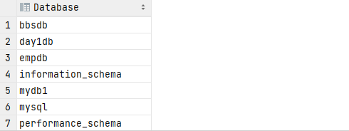

- #### 使用某一个数据库

  ```mysql
  USE mydb;
  ```

- #### 查看某一张表的结构

  ```mysql
  DESC userinfo;
  ```

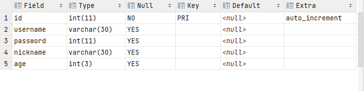

- #### 查看创建后某一张表的详细信息

  ```mysql
  SHOW CREATE TABLE userinfo;
  ```

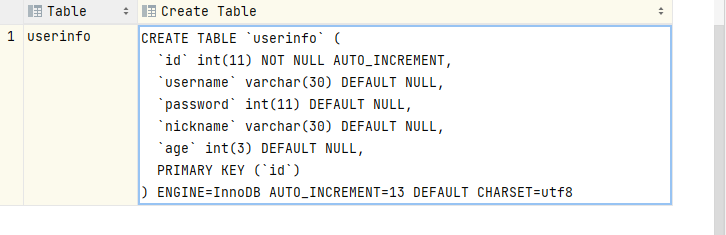

- #### 查看当前数据库创建的所有表(固定)

  ```mysql
  SHOW TABLES;
  ```

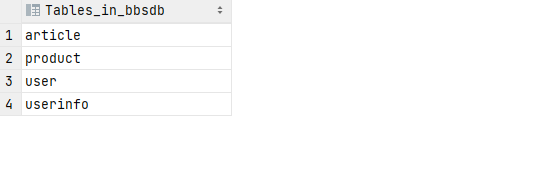

# 二. 表相关的操作

### DDL语句:数据定义语言,用来操作数据库对象的.

### 数据库对象:表,视图,索引都属于数据库对象.

# ★总结：

## DDL语言:数据定义语言,操作数据库对象

## 关键字:CREATE,ALTER,DROP,ADD,CHANGE

### 1. 创建表:CREATE TABLE 表名();

### 2. 添加表中结构: ALTER TABLE 表名 ADD 要添加的列名 类型[长度] AFTER 字段名(在...之后);

### 3. 删除表中结构: ALTER TABLE 表名 DROP 要删除的列名;

### 4. 修改表: ALTER TABLE 表名 CHANGE 原字段名 新字段名 新类型;

### 5. 删除表: DROP TABLE;

# ★总结：

## DML语言:数据操作语言,是对表中的数据进行操作的语言,包含:增,删,改操作

### 关键字:[INSERT语句 INTO VALUES] [DELETE语句 FROM] [UPDATE语句 SET WHERE]

### (1). 表中插入数据: INSERT INTO 表名(列名) VALUES(传参)

### (2). 删除表数据: DELETE FROM 表名 [WHERE 过滤条件]---若不加条件就会删除整张表及所有数据

### (3). 修改表数据: UPDATE 表名 SET 字段值=？ [WHERE 过滤条件]---若不加条件可能引起范围修改

## 1. 数据类型

### (1). 整数:INT(m)和BIGINT(m).m表示的是长度 例如:m=5 存数字18 实际存储:00018

### (2). 浮点数:DOUBLE(m,n)。m表示数字长度(整体数字的长度，包含小数)，n表示小数位 DOUBLE(5,3) 99.999

### 注：INSERT INTO XXX VALUES(12.9984) 实际插入数据时当精度超过可保存范围时，会进行四舍五入

## 2. 字符类型

### (1). CHAR(n):定长字符串。每条记录实际占用的字节空间是定长的，不足的部分补充空字符来满足长度要求

#### 优点:查询速度快 缺点:浪费磁盘空间

### (2). VARCHAR(n):(变长字符串)。最多存n指定的字节数对应的字符，实际保存是用多少占多少。(推荐)

#### 优点:节省磁盘空间 缺点:查询速度慢

### (3). TEXT(n):可变长字符串，最大65535

## 3. 日期时间类型

### (1). DATE:保存年月日

### (2). TIME:保存时分秒

### (3). DATETIME:保存年月日十分秒

### (4). TIMESTAMP:时间戳，记录UTC时间，从1970-01-01 00:00:00到表示的时间之间经过的毫秒

## 4. 约束

### (约束是为表中某个字段添加特定的限制条件，只有符合条件的记录才可以保存)

### 1. 非空约束:该字段的值不允许为空

### 2. 外键约束:实际开发中几乎不使用外键约束

# ★总结：

## DQL语句：数据查询语句

## 1. 基本语法：

### SELECT 字段名1[,字段名2...或 * ] FROM 表名;

## 2. WHERE子句,用来添加过滤条件,此时可以仅将满足条件的记录查询出来

### 比较运算符：=,>,>=,<,<=,<>(不等于)----!=操作不是所有的数据库都支持

### SELECT(选择) FROM(来自于) WHERE(哪里)

## 3. AND,OR来连接多个条件---★AND优先级高于OR,可以通过括号()来提高OR的优先级

### AND:都为真时才为真-------------相当于java中&&(与) 但这里不存在短路现象

### OR:都为假时才为假-------------相当于java中||(或)

### 例：查看2号部门工资高于1000的员工的名字,工资,职位,部门编号？---两个条件AND

```mysql
SELECT name,sal,job,dept_id
FROM emp
WHERE dept_id=2 AND sal>1000;
```

## 4.IN(列表) 值在列表中(等于列表中的其中之一)----★获取同一字段的子集时用IN

## NOT IN(不在列表) 值不在列表中

### 例：查看职位是人事和销售的所有员工的名字,工资,职位,部门编号？

```mysql
SELECT name,sal,job,dept_id
FROM emp
WHERE job IN('人事','销售');
```

## 5.DISTINCT用于去除指定列重复值的行----distinct(不同的)

## (1).DISTINCT关键字去重

### 例：查看公司有多少种职位？---单列去重

```mysql
SELECT DISTINCT job 
FROM emp;
```

## (2).多列去重时,就是去除指定这些列的值的组合有重复的行

### 例：去除职位与部门编号重复的行

```mysql
SELECT DISTINCT job,dept_id 
FROM emp;
```

## 6. 模糊查询:LIKE

### LIKE中两个通配符:_和%

### (1). _(下划线):表示任意的一个字符

### (2). %:表示任意个字符(0-多个)

### 例：查看姓孙的员工信息？(名字第一个字符是孙的员工)

```mysql
SELECT *
FROM emp
WHERE name LIKE '孙%';
```

## 总结：

### 1. %X%：字符串中包含'X'

### 2. %X：字符串以X结尾

### 3. X%：字符串以X开头

### 4. _X%：字符串第二个字符是X

### 5. %X_：倒数第二个字符是X

### 6. X%Y：字符串以X开头以Y结尾

### 7. X_Y：字符串只有三个字,第一个是X,第三个是Y

## 7. 排序-----ORDER(order顺序)----ASC升序(默认),DESC降序

### ORDER BY子句,根据指定的字段排序查询结果集,该子句只能放在查询语句的最后一个子句上

### 例：查看公司所有员工的姓名和工资,且按工资从低到高排序

```mysql
SELECT name,sal
From emp
ORDER BY sal;
```

## 8.分页查询----LIMIT(A,B)(limit 限制)

### (1). 将满足查询条件的数据分段分批的查询出来。这可以减少不必要的系统开销。

### (2). 分页查询在SQL92标准没有定义，这意味着不同的数据库，分页查询方式完全不一样。

### (3). 在ORDER BY中使用LIMIT来完成的

### (4). A: "跳过的"记录数,请求的记录数(每页显示的记录数)

### (5). B: (页数-1)*每页显示的记录数,每页显示的记录数

### (6). 不跟在ORDER BY后面也行,但建议跟,因为排序后再分页比较清晰

## 9. 查询的字段可以使用表达式

### 例： 查看每个员工的年薪是多少？

```mysql
SELECT name,sal,sal*12
FROM emp;
```

## 10.查询时也可以用函数的结果作为字段

### 例： 孙悟空的职位是销售 name+"的职位是"+job(java中)

```mysql
SELECT CONCAT(name,'的职位是',job) 
FROM emp;
#孙悟空的职位是销售...
```

## 11.数字与NULL进行运算,结果为NULL

```mysql
例：
SELECT name,sal,comm,sal+comm
FROM emp;
```

## 12.NVL函数 用来替换NULL值

### NVL(arg1,arg2) 当arg1不为null时则函数返回arg1的值,如果arg1为null则返回arg2的值：

```mysql
SELECT name,sal,NVL(comm,0) FROM emp;#第一个参数为NULL返回第二个参数值
```

## 13.别名

### 我们可以为字段定义别名,也可以给表定义别名。

### 为字段定义别名一般多用于:

### 1:隐藏实际表字段名

### 2:为计算表达式或函数的结果只作为字段时定义可读性更好的字段名

### 3.语法：SELECT 字段1 别名1,字段2 别名2 FROM 表名;

```mysql
SELECT name ename,sal salary FROM emp;
SELECT name,sal*12 salary FROM emp;
```

### ★支持的语法

### 字段名 别名

```mysql
SELECT name,sal*12 salary FROM emp;
```

### 字段名 as 别名

```mysql
SELECT name as ename,sal*12 salary FROM emp;
```

### 字段名 as '别名'

```mysql
SELECT name as 'ename',sal*12 'salary' FROM emp;
```

### 字段名 as "别名"

```mysql
SELECT name as "ename",sal*12 "salary" FROM emp;
```

### 查询表emp中的所有数据

```mysql
SELECT * FROM emp;
```

## 14.聚合函数(也称为多行函数):用来将多条记录统计为一条记录---忽略NULL值

### (1). MIN():求最大值

### (2). MAX():求最小值

### (3). AVG():求平均值

### (4). SUM():求和

### (5). COUNT():统计某一字段的数量中间不能加空格----通常(*)

## 注意：

### 例：查看部门平均工资高于2000的那些部门的平均工资具体是多少?

### ★聚合函数不能写在WHERE子句中

```mysql
SELECT AVG(sal),dept_id
FROM emp
WHERE AVG(sal)>2000
GROUP BY dept_id;
#会报错：Invalid use of group function
```

### ★原因是过滤时机并不相同

### WHERE子句是添加过滤条件，在查询表中每条记录时，用于筛选记录。(查询表的过程中用于过滤的)

## 15. GROUP BY 分组

### GROUP BY 也是统计服务的,所以是搭配在聚合函数上使用的。

### 注：SELECT字句中不在聚合函数中的其他字段必须出现在GROUP BY字句中！

```mysql
SELECT dept_id,AVG(sal)
FROM emp
GROUP BY dept_id;
```

## 16. HAVING子句。HAVING子句是跟在GOURP BY子句之后，对分组统计的出的结果集再进行过滤的。

### 注：想利用聚合函数的结果进行过滤时，应当已经是将表中数据查询出来(此时是WHERE过滤的时机)，并且对结果集进行了统计后得到的结果集再进行过滤

### 例：查看平均工资大于2000的部门的平均工资是多少?

```mysql
SELECT dept_id,AVG(sal) avg
FROM emp
GROUP BY dept_id #按照部门分组
HAVING avg>2000; #HAVING在统计结果之后进行过滤,可过滤函数
```

## 17.子查询

### 嵌套在其他SQL语句中的查询语句被称为叫做"子查询"

### 子查询通常用于要基于一个"查询结果"再进行操作的地方

### 例：查看比公司平均工资高的那些员工的名字和工资是多少？

### 一.先求公司的平均工资

```mysql
SELECT AVG(sal)
FROM emp;
```

### 二.类似于Java,将求平均工资部分挪到下面条件语句中加上括号优先执行(嵌套)

```mysql
SELECT name,sal
FROM emp
WHERE sal>(SELECT AVG(sal)
FROM emp);#因为括号里的先执行故可以用WHERE
```

## 例1：查询比2号和3号部门工资都高的员工名字和工资？

## @*可以用(ALL)关键字*

### (第1种方法).先用ORDER BY排序DESC降序和LIMIT取第1个最大值

```mysql
SELECT sal
FROM emp
WHERE dept_id IN (2,3)
ORDER BY sal DESC
LIMIT 0,1;

SELECT name,sal
FROM emp
WHERE sal>(SELECT sal
FROM emp
WHERE dept_id IN (2,3)
ORDER BY sal DESC
LIMIT 0,1);
```

### (第2种方法).先用MAX获取一列的工资最大值

```mysql
SELECT MAX(sal)
FROM emp
WHERE dept_id IN(2,3);

SELECT name,sal
FROM emp
WHERE sal>(SELECT MAX(sal)
FROM emp
WHERE dept_id IN(2,3));
```

### (第3种方法).直接使用"ALL"关键字

```mysql
SELECT name,sal
FROM emp
WHERE sal>ALL(SELECT sal
FROM emp
WHERE dept_id IN(2,3));
```

## 例2：查询大于2号和3号部门工资最低的员工的名字和工资,共9个

## @*引入(ANY)关键字*

```mysql
SELECT name,sal
FROM emp
WHERE sal>ANY(SELECT sal
FROM emp
WHERE dept_id IN(2,3));
```

# ★总结：

### 1. 子查询分类(按查询结果集分类)：

### 2. 多行单列子查询(结果集有多个值)

### 3. 多行多列子查询(结果集是一个表)

### 注：

### 1. 单行子查询通常用于过滤条件中使用

### 2. 单行单列可以配合>,>=,=,<,<=使用

### 3. 多行单列可以配合ANY,ALL,IN使用.

### 例如：

### 1. >ALL(子查询)：大于子查询结果集中最大的

### 2. <ALL(子查询)：小于子查询结果集中最小的

### 3. >ANY(子查询)：大于子查询结果集中最小的

### 4. <ANY(子查询)：小于子查询结果集中最大的

### 多行多列子查询(结果集是一个表),通常就当做一张表使用,可以跟在FROM字句中----AS关键字或者跟在DDL语句中基于一个查询结果集创建表.

### 例：将1号部门员工信息单独定义一张表名为emp_dept1;

```mysql
#创建一个新表
CREATE TABLE emp_dept1
AS
SELECT * FROM emp WHERE dept_id=1;
```

## 注意：如果创建表基于的子查询中某个字段是一个表达式或函数时,要给该字段取别名,那么创建出来的表的该字段会以别名作为字段名.

### 例：创建一张表emp_dept_sal.该表记录了每个部门的薪资情况

### 其中包含最高工资,最低工资,平均工资,工资总和,部门编号：

```mysql
CREATE TABLE emp_dept_sal
AS
SELECT MAX(sal) max_sal,MIN(sal) min_sal,AVG(sal) avg_sal,SUM(sal) sum_sal,dept_id
FROM emp
GROUP BY dept_id;#按照部门进行分组
#最后查询并验证表emp_dept_sal的所有数据
SELECT * FROM emp_dept_sal;
```

## 18.★关联查询

### 查询结果集中的数据来自多张表,而表与表中数据之间的对应关系就是关联关系

### 两张表就可以产生关联关系了,关联关系分为三类

### 1：一对一 A表中的1条记录只唯一对应B表中的1条记录

### 2：一对多 A表中的1条记录可以对应B表中的多条记录

### 3：多对多 A表与B表双向都是一对多时,就是多对多关系.

## A. 关联查询就是基于多张表联合查询数据而形成一个结果集的过程,在关联查询中一个至关重要的点就是关联条件

## B. N张表关联查询至少要有N-1个连接条件.

## C. 缺失连接条件会产生笛卡尔积,该查询结果集的记录数是关联表中所有记录数乘积的结果,它通常是一个无意义的结果集，要尽量避免产生.

## D. ★关联查询语法:

### SELECT 字段 FROM 表A，表B[，表C，表D...]

#### WHERE 过滤条件

#### AND 连接条件

### 注意:连接条件必须与过滤条件同时成立!!

### 例：笛卡尔积的产生：

#### 产生了44条数据，将emp表每条记录都与dept表每条记录产生一条记录。

```mysql
SELECT *
FROM emp,dept;
```

## E.实际关联查询要"添加连接条件"：连接条件最常见的就是等值连接。

### 例：查看每个员工的名字，工资，部门编号以及所在的部门名称和所在地区

```mysql
SELECT e.name,e.sal,e.dept_id,d.name,d.loc
FROM emp e,dept d
WHERE e.dept_id=d.id;
```

### 注:emp表上的dept_id保存的值是dept表中主键字段的值，因此emp表中dept_id与dept表id值一样的记录才会被查询出来作为一条记录显示在结果集中。

## F. ★当一张表上的某个字段保存的是另一张表中的主键字段值时，这个字段就被称为"外键"

### 关联关系中经常用A.主键=B.外键作为连接条件。

### 例：查询表emp中工资最高的人住哪loc？

### 1.先查询工资最高是多少？

```mysql
SELECT MAX(sal)
FROM emp;
```

### 2.再查询工资最高的人是谁？

```mysql
SELECT name
FROM emp
WHERE sal=(SELECT MAX(sal)
           FROM emp);
```

### 3.最后查询工资最高的人住哪？

```mysql
SELECT d.loc
FROM emp e,dept d
WHERE e.dept_id = d.id
AND e.name=(SELECT name
            FROM emp
            WHERE sal=(SELECT MAX(sal)
                       FROM emp));
```

### 查询两张表的所有数据

```mysql
SELECT * FROM dept;
SELECT * FROM emp;
```

## 19.内连接JOIN子句

### (1).内连接与关联查询效果一致,区别是单独书写关联关系(关联条件与过滤条件分开)

### (2).JOIN..ON..子句可以写多个,当连接多张表时使用

### 语法例：

```mysql
SELECT 字段
JOIN B表 b
ON a.xx=b.xx(连接条件)
JOIN C表 c
ON c.xxx=b.xxx或c.xxx=a.xxx
JOIN .... ON ...(以此类推)
```

### (3).在内连接中,过滤条件还是写在WHERE子句中

#### 例：查看工资高于1300的员工信息和所在的部门信息

```mysql
#SELECT 字段
#FROM 表1
#JOIN 表2
#ON 连接条件
#WHERE 过滤条件

SELECT e.name,e.job,e.manager,e.sal,d.name,d.loc
FROM emp e
JOIN dept d
ON e.dept_id = d.id #连接条件
WHERE e.sal>1300; #过滤条件
```

### (4).在关联查询中不满足连接条件的记录会被排除在外的

### 例：查看每个员工和部门的信息

#### a.关联查询方式------"灭霸"是五号部门在dept表中没有对应故不满足连接条件

```mysql
SELECT e.name,e.job,e.manager,e.sal,d.name,d.loc
FROM emp e,dept d
WHERE e.dept_id=d.id;
```

#### b.内连接查询方式

```mysql
SELECT e.name,e.job,e.manager,e.sal,d.name,d.loc
FROM emp e
JOIN dept d
ON e.dept_id = d.id;
```

## 20.外连接：如果需要在结果集中列出不满足连接条件的记录时我们需要使用外连接

### ★外连接有:

#### (1).左外连接:以LEFT JOIN左侧表作为主表,其中的记录都要展示,不满足连接条件时,来自右侧表中记录的字段值全部为NULL

#### (2).右外连接:以RIGHT JOIN右侧表作为主表,其中的记录都要展示,不满足连接条件时,来自左侧表中记录的字段值全部为NULL

### a.左外连接演示(LEFT JOIN)

```mysql
SELECT e.name,e.job,e.manager,e.sal,d.name,d.loc
FROM emp e
LEFT JOIN dept d
ON e.dept_id = d.id;
```

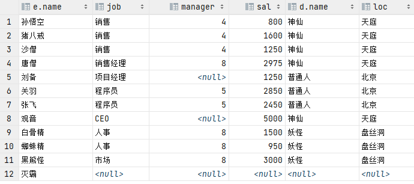

### b.右外连接演示(RIGHT JOIN)

```mysql
SELECT e.name,e.job,e.manager,e.sal,d.name,d.loc
FROM emp e
RIGHT JOIN dept d
ON e.dept_id = d.id;
```

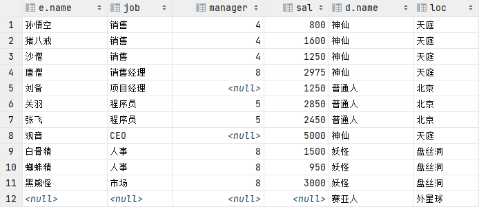

## ★使用UNION关键字将左右连接并在一起(取并集)

### （达到全连接效果,结果集包含满足连接条件的和左连接,右连接的左右数据）

### 例：

```mysql
SELECT e.name,e.job,e.manager,e.sal,d.name,d.loc
FROM emp e
LEFT JOIN dept d
ON e.dept_id = d.id
UNION #可以将两条并在一起(并集)
SELECT e.name,e.job,e.manager,e.sal,d.name,d.loc
FROM emp e
RIGHT JOIN dept d
ON e.dept_id = d.id;
```

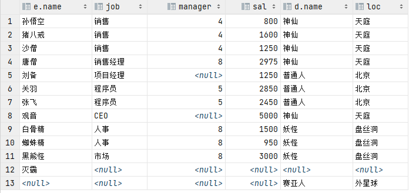

## 例：查看比所在地区平均工资高的员工？

### 第一步.查看每个员工的工资及其所在的地区

```mysql
SELECT e.sal,d.loc
FROM emp e,dept d
WHERE e.dept_id=d.id;
```

### 第二步.先查询每个地区对应的平均工资(按照loc字段分组)----把该查询结果看成一张表

```mysql
SELECT d.loc,AVG(e.sal) avg_sal
FROM emp e,dept d
WHERE e.dept_id=d.id
GROUP BY d.loc;
```

### 第三步.关联三张表查询:员工表-部门表-(第2步子查询的结果集当成的表)

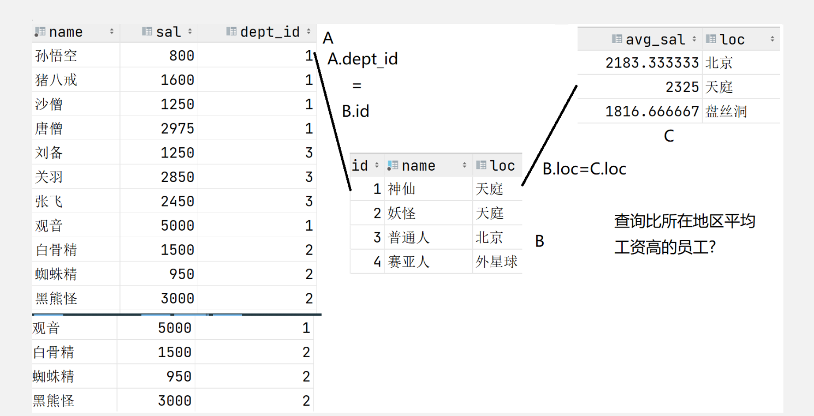

### 查询emp表数据

```mysql
SELECT * FROM emp;
```


### (1).关联查询

```mysql
SELECT e.name,a.loc,e.sal,a.avg_sal,e.dept_id
FROM emp e,dept d,(SELECT d.loc,AVG(e.sal) avg_sal
                   FROM emp e,dept d
                   WHERE e.dept_id=d.id
                   GROUP BY d.loc ) a
WHERE e.dept_id=d.id
AND d.loc = a.loc
AND e.sal>a.avg_sal
ORDER BY dept_id; #按照部门ID排序,使结果清晰！
```

### (2).内连接查询

```mysql
SELECT e.name,a.loc,sal,a.avg_sal,e.dept_id
FROM emp e #员工表
JOIN dept d #部门表
ON e.dept_id=d.id #员工表与部门表的连接关系
JOIN (SELECT d.loc,AVG(sal) avg_sal #子查询表
      FROM emp e,dept d
      WHERE e.dept_id=d.id
      GROUP BY d.loc) a
ON d.loc = a.loc #子查询表与另外两张表其中之一的连接关系
WHERE e.sal>a.avg_sal #过滤条件
ORDER BY dept_id; #按照部门ID排序,使结果清晰！
```

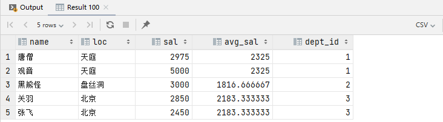

## 21.自连接

### (1).该表中的一条记录可以对应该表中的其他多条记录时,就是自连接的关联关系

### (2).自连接的设计是为了保存同样一组属性的数据之间存在上下级关系时(树状结构数据)

### (3).公司的员工组织结构,对于公司而言大家都属于员工,但是员工之间又存在上下级关系。

### (4).电商中常见的分类树

### 例：查看每个员工和他的领导是谁？

```mysql
SELECT e.name,m.name
FROM emp e,emp m
WHERE e.manager=m.id;
```

##### 若使用内连接：

```mysql
SELECT e.name,m.name
FROM emp e
JOIN emp m
ON e.manager=m.id;
```

# ☆JDBC(Java DataBase Connectivity,java数据库连接)

## 1.简介：

### (1).JDBC是有SUM提供的一套API，是使用java连接数据的一套标准API接口，各个数据库提供上都实现了这一条接口提供了连接其提供的数据库产品的实现类(以jar包形式，又称为连接该数据库的驱动包)。

### (2).是一种用于执行SQL语句的Java API，可以为多种关系数据库提供统一访问，它由一组用Java语言编写的类和接口组成。JDBC提供了一种基准，据此可以构建更高级的工具和接口，使数据库开发人员能够编写数据库应用程序。

## 2.使用JDBC连接数据库的步骤

### (1):加载驱动 Class.forName()

```java
//第一步：
//不同数据库的包名,类名不一样,但是对于同一个数据库无论哪个版本写法都一样
Class.forName("com.mysql.cj.jdbc.Driver");
```

### (2):建立连接 DriverManager建立连接

```java
//第二步：
/*DriverManager的getConnection用来连接数据库,该方法需要传入三个参数
参数1：数据库的URL地址(每种数据库有各自的固定格式)
参数2：用户名
参数3：密码
该方法返回一个java.sql.Connection的实例(Connection是一个接口,是JDBC核心接口之一,表)*/
Connection conn = DriverManager.getConnection()
```

### (3):获取执行对象

```java
//第三步
//通过连接对象Connection获取执行SQL的执行对象Statement
Statement statement = conn.createStatement();
```

### *例：新建一张表*

```java
//新建一张表：userinfo
//表字段：id,username,password,age,salary
String sal = "CREATE TABLE userinfo(" +
             "    id INT primary key auto_increment," +
             "    username VARCHAR(30) NOT NULL ," +
             "    password VARCHAR(30)," +
             "    age INT(3)," +
             "    salary DOUBLE(7,2)" +
             ")";
```

### ★execute(String sql)方法

#### 该方法可以用来执行任意类型的SQL语句,但是由于DML,DQL有专门的的SQL

#### 因此该方法常用于执行DDL语句(CREATE,DROP,ALTER)

#### 注意：在sql查询时数据库的URL地址要使用该数据库empdb后再去查询

```java
statement.execute(sal);//到SQL控制台可以查到该表的创建
```

## 3.执行DML语句(数据操作语言)

### ★int executeUpdate(String sql)

#### 该方法通常用来专门执行DML(INSERT,UPDATE,DELETE)语句，返回的int值表示影响了表中多少条记录

### *例：向class表中插入数据：1年级1班*

```java
Class.forName("com.mysql.cj.jdbc.Driver");//获取SQL的加载路径
try (   //与SQL建立连接
        Connection conn = DriverManager.getConnection("jdbc:mysql://localhost:3306/empdb", "root", "root");
) {
    Statement statement = conn.createStatement();
    /*
    向class表中插入数据:1年级1班
    */
    String sql = "INSERT INTO class (name) VAlUES ('1年级1班')";
    /*
    int executeUpdate(String sql)
    通常用来专门执行DML(INSERT,UPDATE,DELETE)语句，返回的int值表示影响了表中多少条记录
    */
    int num = statement.executeUpdate(sql);
   if(num>0){//说明至少影响了表中1条记录
    System.out.println("插入成功");
    }else{
    System.out.println("插入失败");
    }
}catch (Exception e){}
```

## 4.指定DQL语句(数据查询语言)

### Statement中有专门用来执行查询语句DQL的方法:

### ★ResultSet executeQuery(String sql)

#### 该方法会返回一个ResultSet对象，这个对象封装了查询出来的结果集。

### ★boolean next()

#### 该方法是结果集核心方法之一,由于让结果集游标向下一条记录,返回值表示是否有下一条。

#### 注：游标默认是在结果集第一条记录上

### *例：查看6岁的学生都有谁？*

```java
try(
//事先创建了DBUtil类,在静态块加载SQL路径,getConnection()方法连接数据库
        Connection connection = DBUtil.getConnection();
){
    Statement statement = connection.createStatement();
    String sql = "SELECT id,name,age,class_id "+
                  "FROM student "+
                  "WHERE age=6";
    /*
       结果集的遍历类似集合的迭代器
       boolean next()
       该方法是结果集核心方法之一,由于让结果集游标向下一条记录,返回值表示是否有下一条。
       注：游标默认是在结果集第一条记录上
    */
    ResultSet rs = statement.executeQuery(sql);
    while(rs.next()) {
        //根据字段位置获取
    //          int id = rs.getInt(1);//获取该条记录第一个字段的值(因为该字段是int型，所以用getInt())
    //          String name = rs.getString(2);
    //          int age = rs.getInt(3);
    //          int classId = rs.getInt(4);
        //根据字段名
        int id = rs.getInt("id");
        String name = rs.getString("name");
        int age = rs.getInt("age");
        int classId = rs.getInt("class_id");
        System.out.println(id + "," + name + "," + age + "," + classId);
    }
    //如果结果集数据需要保存，应当在当前java程序中用集合等形式保存结果集使用。
    rs.close();//当结果集遍历完毕后将其关闭
}catch(Exception e){}
```

## 5.预编译SQL语句

### 预编译SQL语句是将在SQL中会变化的值(原来拼接SQL语句的部分)先以"?"进行占位

### 解决拼接SQL语句会存在两个明显问题:

#### (1):代码复杂度高，容易出现错误，且可读性差。

#### (2):存在着SQL注入攻击

### *例：查看任意员工的信息:*

```java
try(
//事先创建了DBUtil类,在静态块加载SQL路径,getConnection()方法连接数据库
        Connection connection = DBUtil.getConnection();
){
    Scanner scanner = new Scanner(System.in);
        System.out.println("请输入要查询的员工名称?");
        String name = scanner.nextLine();
        /*
            拼接SQL语句会存在两个明显问题:
            1:代码复杂度高，容易出现错误，且可读性差。
            2:存在着SQL注入攻击
         */
        /*String sql = "SELECT id,name,salary,dept_id " +
                     "FROM emp " +
                     "WHERE name='"+name+"'";*/
        String sql = "SELECT id,name,sal,dept_id " +
                     "FROM emp " +
                     "WHERE name=?";
        PreparedStatement ps = connection.prepareStatement(sql);
        //name字段是VARCHAR，因此这里设置该?对应的值应当选取字符串类型
        ps.setString(1,name);//第1个"?"要设置为字符串的值'XXX'
        //该方法让结果集游标向下一条记录,返回值表示是否有下一条。
        ResultSet rs = ps.executeQuery();
        if(rs.next()){
            int id = rs.getInt(1);
            String n = rs.getString(2);
            int salary = rs.getInt(3);
            int deptId = rs.getInt(4);
            System.out.println(id+","+n+","+salary+","+deptId);
        }
    } catch (SQLException throwables) {
        throwables.printStackTrace();
    }
```

## 6.在DML语句中使用预编译SQL

### *例：在student1中插入数据:*

```java
    try(
//事先创建了DBUtil类,在静态块加载SQL路径,getConnection()方法连接数据库
            Connection connection = DBUtil.getConnection();
    ){
        String sql = "INSERT INTO student1(name,age,class_id) VALUES(?,?,?)";
        PreparedStatement ps = connection.prepareStatement(sql);
        ps.setString(1,"张三");
        ps.setInt(2,5);
        ps.setInt(3,0);
        //利用该方法返回影响表中数据的条数判断执行情况
        int num = ps.executeUpdate();
        if(num>0){
            System.out.println("插入成功");
        }else{
            System.out.println("插入失败");
        }
    } catch (SQLException throwables) {
        throwables.printStackTrace();
    }
```

## ★总结

#### (1).Statement每次执行SQL语句时，都会将该SQL语句发送给数据库，而数据库接收到SQL语句后会解析SQL语句并生成执行计划(该操作是一个耗时的操作)。然后再执行该计划。当SQL语义相同，但是数据不同时，如果我们执行这些SQL，那么每次数据库接收SQL都要生成执行计划。

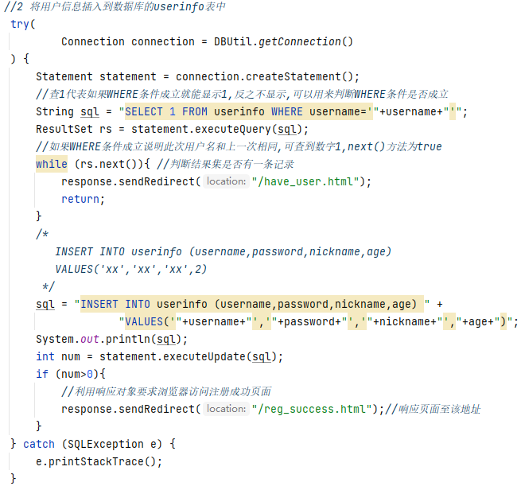

#### (2).PreparedStatement会在创建时先将预编译SQL语句发送给数据库来生成执行计划(仅1次)，并且"?"内容会在生成的执行计划中当作"参数".在多次执行时，每次仅需要将"?"对应的数据发送给数据库，来重用预编译SQL对应的执行计划，这样效率会高很多。

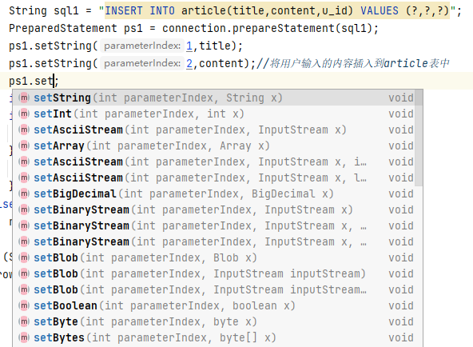

#### Statement执行SQL语句时，数据是需要拼接SQL来完成，这存在SQL注入攻击，但是PreparedStatement会先将预编译SQL发送给数据库生成执行计划，那么所有数据都会被当作参数。因此就算传入的是注入攻击的内容，它也仅会当这部分内容为参数值，语义已经不会发生改变了(因为执行计划已经生成。)

#### 拼接SQL注入攻击内容后，语义发生了改变，因此数据库接收到该SQL是就错误的执行了内容SELECT * FROM userinfo WHERE username='xxx' AND password='1' OR '1'='1'

#### 预编译SQL先行发送给数据，生成执行计划后，数据库就理解了操作，并等待你发送过来用户名和密码的值了SELECT * FROM userinfo WHERE username=? AND password=?当我们发送SQL注入攻击内容时参数1(第一个?的内容):xxx, 参数2(第二个?的内容):1' OR '1'='1此时数据库会理解为你要查询的人的密码是"1' OR '1'='1",并不会将其当作SQL语句的一部分了。

### *例：向student1表中插入1000条数据:*

```java
    try (
//事先创建了DBUtil类,在静态块加载SQL路径,getConnection()方法连接数据库
            Connection conn = DBUtil.getConnection()
    ) {
        /*
        Statement statement = conn.createStatement();
        Random random = new Random();
        long start = System.currentTimeMillis();
        for(int i=0;i<1000;i++) {
            int age = random.nextInt(7) + 6;//年龄6-12岁
            int c = age == 6 ? 1 : (age - 7) * 4 + random.nextInt(4) + 2;//+2是因为1年级的ID从2开始
            String name = NameCreator.createName();
            //拼写：
            String sql = "INSERT INTO student1 (name,age,class_id) VALUES ('" + name + "'," + age + "," + c + ")";
            statement.executeUpdate(sql);
        }
        long end = System.currentTimeMillis();
        System.out.println("插入完毕，耗时:"+(end-start)+"ms");//2098ms
        */
        
        //预编译写法：
        String sql = "INSERT INTO student1 (name,age,class_id) VALUES (?,?,?)";
        PreparedStatement statement = conn.prepareStatement(sql);
        Random random = new Random();
        long start = System.currentTimeMillis();
        for(int i=0;i<1000;i++) {
            int age = random.nextInt(7) + 6;//年龄6-12岁
            int c = age == 6 ? 1 : (age - 7) * 4 + random.nextInt(4) + 2;//+2是因为1年级的ID从2开始
            String name = NameCreator.createName();
            statement.setString(1,name);
            statement.setInt(2,age);
            statement.setInt(3,c);
            statement.executeUpdate();
        }
        long end = System.currentTimeMillis();
        System.out.println("插入完毕，耗时:"+(end-start)+"ms");//498ms

    }catch (Exception e){
            e.printStackTrace();
```